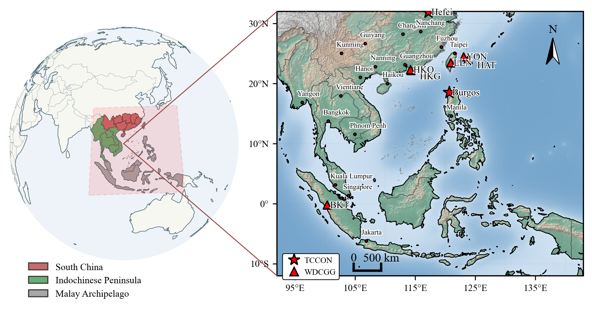
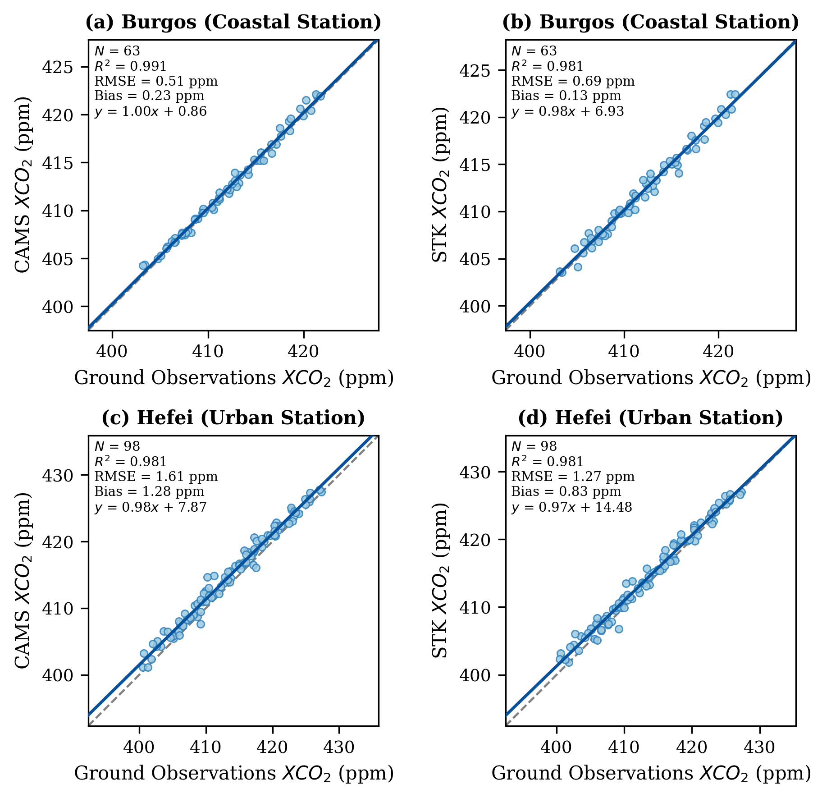

# Southeast-Asia-XCO2-STK: Spatio-Temporal Reconstructed Dataset
[](https://opensource.org/licenses/MIT)

## 📌 Project Overview

This repository provides a seamless monthly high-resolution (**0.1° × 0.1°**) dataset of **column-averaged dry-air mole fraction of carbon dioxide (XCO2)** over South China and Southeast Asia.

Because persistent cloud cover in tropical Southeast Asia leads to substantial gaps in satellite observations, an **adaptive local spatio-temporal kriging (STK)** framework was developed to integrate **OCO-2/3** satellite observations with the **CAMS inversion-optimized background field**. The resulting dataset is spatially and temporally continuous and provides a useful data basis for regional carbon cycle studies.

---

## 📊 Data Sources

### 1. Satellite observations

- **OCO-2/OCO-3 Lite products**  
  NASA Level 2 bias-corrected XCO2 products were used as the primary satellite observations.  
  - **Access**: [NASA GES DISC](https://disc.gsfc.nasa.gov/datasets?keywords=OCO-2%20Lite)

### 2. Background field

- **CAMS greenhouse gas inversion product**  
  The CAMS global greenhouse gas inversion product was used as the background field. Compared with ordinary reanalysis products, this dataset is constrained by global observations and flux optimization, providing a more physically consistent large-scale background for the reconstruction.  
  - **Access**: [Copernicus Atmosphere Data Store (ADS)](https://ads.atmosphere.copernicus.eu/datasets/cams-global-greenhouse-gas-inversion)

### 3. Ground-based validation data

This study uses **TCCON** total-column observations and **WDCGG** surface CO2 observations for independent external validation.

**Table 1. Details of the TCCON and WDCGG observation sites used for validation.**

| Site   | Country     | Network | Geographic setting      | Lon (°E) | Lat (°N) | Elev. (m) |
|--------|-------------|---------|-------------------------|----------|----------|-----------|
| Hefei  | China       | TCCON   | Urban/suburban plain    | 117.17   | 31.90    | 35        |
| Burgos | Philippines | TCCON   | Coastal/island site     | 120.65   | 18.53    | 49        |
| BKT    | Indonesia   | WDCGG   | Mountain site           | 100.318  | -0.20194 | 864       |
| HKG    | China       | WDCGG   | Coastal urban site      | 114.258  | 22.2095  | 60        |
| HKO    | China       | WDCGG   | Coastal urban site      | 114.173  | 22.312   | 65        |
| LLN    | China       | WDCGG   | High-mountain site      | 120.87   | 23.47    | 2862      |
| HAT    | Japan       | WDCGG   | Remote island site      | 123.809  | 24.0607  | 10        |

*TCCON: Total Carbon Column Observing Network; WDCGG: World Data Centre for Greenhouse Gases.*

#### TCCON observations

The **GGG2020** version of TCCON observations was used for independent validation.

- **Burgos Station (Philippines)**  
  Represents the tropical core region of Southeast Asia.  
  - DOI: [10.14291/tccon.ggg2020.burgos01.R0](https://doi.org/10.14291/tccon.ggg2020.burgos01.R0)

- **Hefei Station (China)**  
  Represents the northern boundary of the study region and an area influenced by both urban emissions and monsoon circulation.  
  - DOI: [10.14291/tccon.ggg2020.hefei01.R1](https://doi.org/10.14291/tccon.ggg2020.hefei01.R1)

#### WDCGG observations

High-precision global surface CO2 observations from WDCGG were used to provide supplementary validation from the near-surface atmospheric perspective.

- **Access**: [WDCGG CO2 data search](https://gaw.kishou.go.jp/search/gas_species/co2/latest)

---

## 🗺️ Visuals

### Figure 1. Study area


### Figure 2. Workflow


---

## 📂 Project Structure

```text
Southeast-Asia-XCO2-STK/
├── README.md
├── LICENSE
├── CITATION.cff
├── requirements.txt
├── .gitignore
├── src/
│   ├── step01_data_preprocessing.ipynb
│   ├── step02_stk_reconstruction.ipynb
│   ├── step03_technical_validation.ipynb
│   └── step04_spatiotemporal_patterns.ipynb
├── data/
│   ├── cams/
│   ├── ground_obs/
│   │   ├── TCCON/
│   │   └── WDCGG/
│   └── Satellite/
│       ├── step01_QA_Control/
│       ├── step02_grid/
│       └── step03_Keeling_curve/
├── output/
│   ├── oco2_xco2_month_2015_2024_stk_SEA.nc
│   ├── trend/
│   └── Validation/
└── docs/
    ├── reproducibility.md
    ├── variable_description.md
    └── figures/
````

* `src/`: main notebooks for data preprocessing, STK reconstruction, technical validation, and spatiotemporal pattern analysis.
* `data/cams/`: CAMS background XCO2 data used in the reconstruction workflow.
* `data/ground_obs/`: ground-based observations used for validation, including TCCON and WDCGG datasets.
* `data/Satellite/step01_QA_Control/`: quality-controlled OCO-2 and OCO-3 tabular files.
* `data/Satellite/step02_grid/`: gridded daily OCO-2 and OCO-3 XCO2 data.
* `data/Satellite/step03_Keeling_curve/`: monthly adjusted OCO-2 and OCO-3 XCO2 data.
* `output/`: reconstructed dataset, trend analysis results, and validation outputs.
* `docs/`: supplementary documentation, including reproducibility notes, variable descriptions, and figures.

---

## 🚀 Getting Started

### 1. Environment setup

Install the required Python packages in **Google Colab** or a Linux environment:

```bash
pip install -q netCDF4 joblib tqdm xarray pykrige gstools scipy
pip install -q regionmask geopandas geodatasets cartopy
```
Alternatively, install all dependencies from the provided requirements file:
```bash
pip install -r requirements.txt
'''
### 2. Clone the repository

```bash
git clone https://github.com/hongxu-yn/Southeast-Asia-XCO2-STK.git
cd Southeast-Asia-XCO2-STK
mkdir -p data
```

### 3. Obtain the source data

The raw source datasets used in this study are not fully redistributed in this repository because of their large file size and the access policies of the original providers.

Users should obtain the required source data from the official providers before running the workflow. The main source datasets include:

* OCO-2 Level 2 Lite Full Physics XCO2 product
* OCO-3 Level 2 Lite Full Physics XCO2 product
* CAMS background XCO2 data
* TCCON observations
* WDCGG observations

After downloading the required data, users should place them in the appropriate local directories before running the notebooks.

### 4. Run the workflow

The main notebooks should be run in the following order:

1. [`step01_data_preprocessing.ipynb`](https://colab.research.google.com/github/hongxu-yn/Southeast-Asia-XCO2-STK/blob/main/src/step01_data_preprocessing.ipynb)
2. [`step02_stk_reconstruction.ipynb`](https://colab.research.google.com/github/hongxu-yn/Southeast-Asia-XCO2-STK/blob/main/src/step02_stk_reconstruction.ipynb)
3. [`step03_technical_validation.ipynb`](https://colab.research.google.com/github/hongxu-yn/Southeast-Asia-XCO2-STK/blob/main/src/step03_technical_validation.ipynb)
4. [`step04_spatiotemporal_patterns.ipynb`](https://colab.research.google.com/github/hongxu-yn/Southeast-Asia-XCO2-STK/blob/main/src/step04_spatiotemporal_patterns.ipynb)

These notebooks can be opened directly in Google Colab using the links above.

Detailed workflow instructions are provided in [`docs/reproducibility.md`](docs/reproducibility.md).


Detailed instructions are provided in [`docs/reproducibility.md`](docs/reproducibility.md).

---

## 📦 Data Availability

The reconstructed monthly 0.1° XCO2 dataset over South China and Southeast Asia for **2015–2024** has been deposited in **Zenodo**.

The public DOI and access link will be added here once the Zenodo record is published.

This GitHub repository mainly provides the processing notebooks, documentation, selected intermediate products, validation outputs, and supplementary materials associated with the dataset.

---

## ✅ Technical Validation

The reconstructed dataset was evaluated against independent **TCCON** observations.
* **Burgos**: $R^2 = 0.981, RMSE = 0.69\ \mathrm{ppm}$
* **Hefei**: $R^2 = 0.981, RMSE = 1.27\ \mathrm{ppm}$
  

Comparison of CAMS and STK-reconstructed XCO2 against TCCON observations at the Burgos and Hefei sites.

Additional validation against OCO-3 and WDCGG is also included in the repository outputs.
---

## 📘 Documentation

Additional documentation is available in:

* [`docs/reproducibility.md`](docs/reproducibility.md)
* [`docs/variable_description.md`](docs/variable_description.md)

---

## 📖 Citation

If you use this repository or the associated dataset, please cite the corresponding data paper and dataset record.

> Shi, X., Zhou, G., Yang, L., Zhang, J., Zhang, M., & Xu, H. (2026). *A seamless monthly 0.1° XCO2 dataset over South China and Southeast Asia derived from OCO-2 observations and CAMS background fields (2015–2024).* Scientific Data (submitted).

---

## 📄 License

This project is licensed under the **MIT License**. See the `LICENSE` file for details.

Note that this license applies to the source code in this repository. External datasets remain subject to the licensing and data-use policies of their original providers.

```

